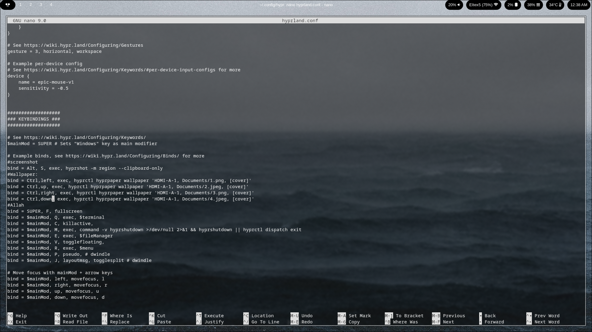
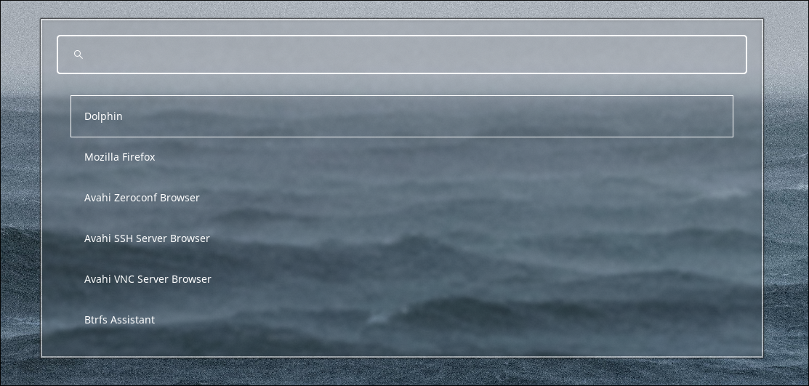
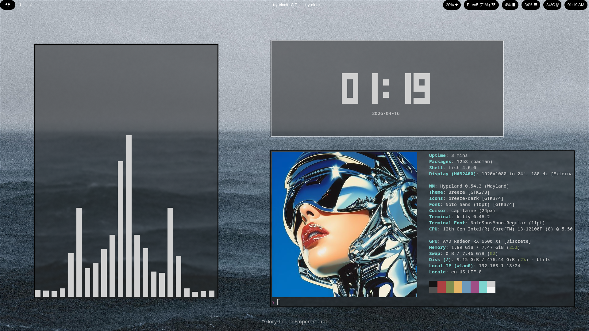

# Clear-Hyprland 
> My first ever Dotfiles
> A sleek, minimalist monochrome rice for **Hyprland**

This repository contains my personal Hyprland configuration, focusing on a high-contrast black-and-white aesthetic, clean typography, and workflow efficiency.

---

## 📸 Preview

<table border="0">
  <tr>
    <td align="center">
      
      <br><b>Clean Workspace</b><br>Minimalist top bar and zero-clutter view.
    </td>
    <td align="center">
      
      <br><b>Config Management</b><br>Structured <code>hyprland.conf</code> with optimized keybindings.
    </td>
  </tr>
  <tr>
    <td align="center">
      
      <br><b>App Launcher</b><br>Blurred, monochrome application menu (wofi/rofi).
    </td>
    <td align="center">
      
      <br><b>System Overview</b><br>Visualizers, clock, and hardware status.
    </td>
  </tr>
</table>

---

---

## 🚀 Installation

### 1. Clone the repo
```bash
git clone [https://github.com/your-username/Black-White.git](https://github.com/your-username/Black-White.git)
cd Black-White
